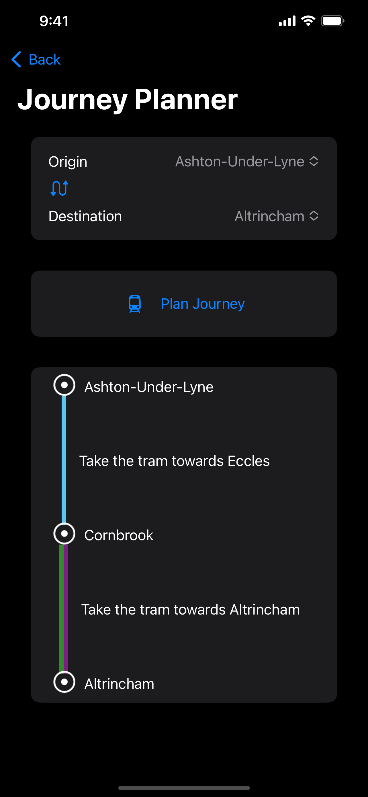
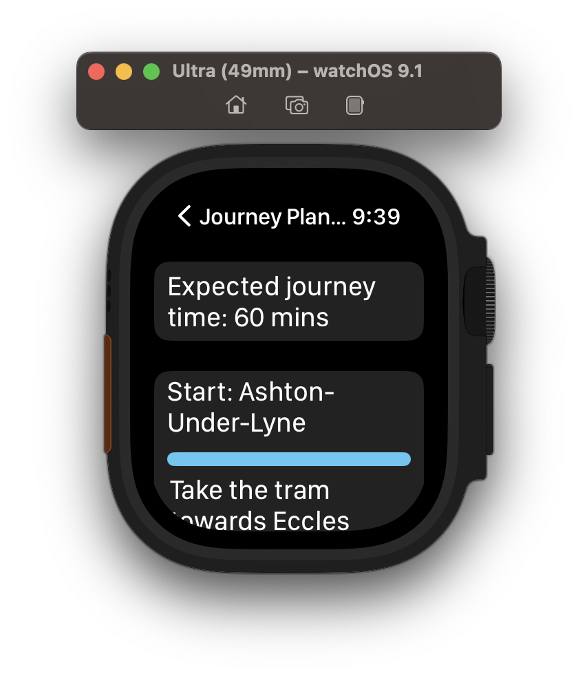
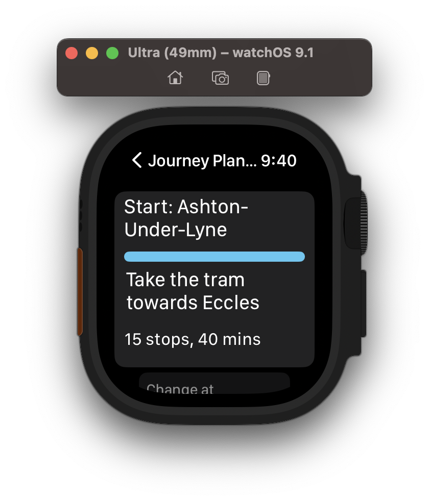
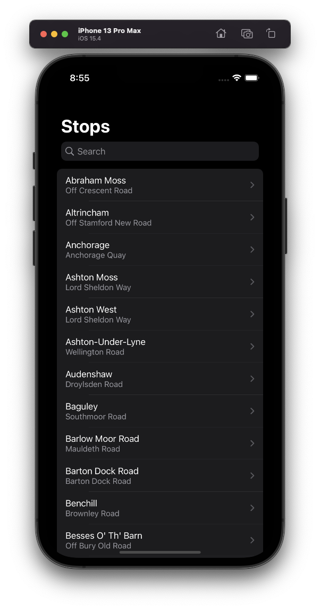
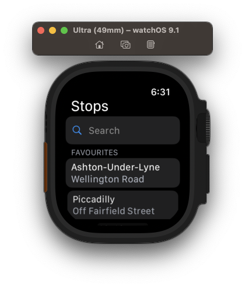
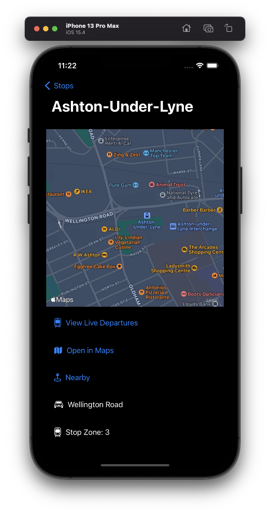
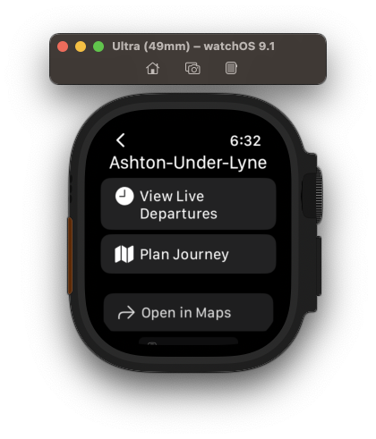
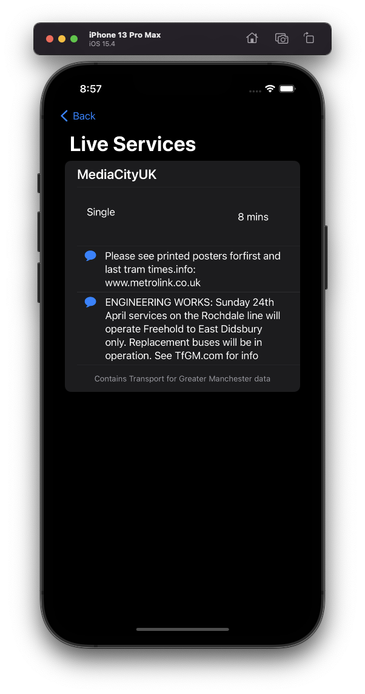
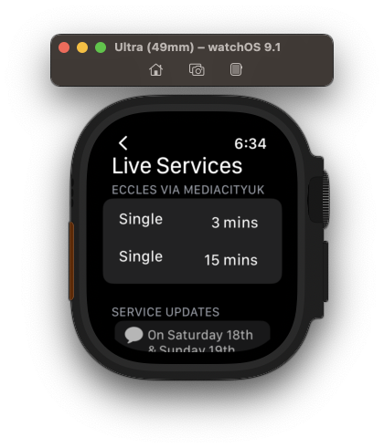
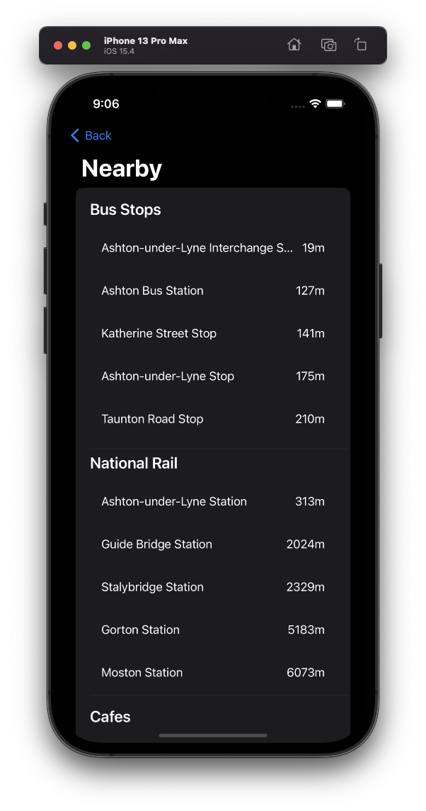

# LiveTramsMCR

## Contents
1. [Introduction](#introduction)
2. [Project Goals](#project-goals)
3. [Project Status](#project-status)
4. [Demo Screenshots](#demo-screenshots)
5. [Declaration](#declaration)

## Introduction
This is an iOS application built using SwiftUI that uses the [TfGM-API-Wrapper Project](https://github.com/dave-t-c/TfGM-API-Wrapper) to retreive and present data related to Manchester Metrolink Services / Stops

## Project Goals
- Create a mobile frontend for the TfGM-API-Wrapper project- Experiment with SwiftUI
- Learn some Swift in the process
- Use some of Swifts features such as MapKit

Please note: This project was created for a bit of fun and to learn a bit more and use SwiftUI, so most likely doesn't follow best practices 😀

## Project Status
The project currently features:
- Displaying all stops and the road they are on in a searchable list
- Detailed stop view including a map of the area, it's stop zone and a link to open in Apple maps for directions
- View of live services split by destination, including relevant messages, e.g. for engineering work.
- View of nearby bus stops, national rail stations and cafes for each stop.
- Journey planning between any stop on the network.

## Demo Screenshots
## Journey Planner

 

### All Stops

### Detailed Stop View

### Live Services

### Nearby Locations

## Declaration
This program is in no way associated with TfGM.

The data in this application is used under the Open Government Licence v3.0

This program contains Transport for Greater Manchester data

The app icon currently uses SF Symbols, which belong to Apple. This app icon is being used for testing and development. The final app icon will not contain SF Symbols as to comply with App store guidelines. 
