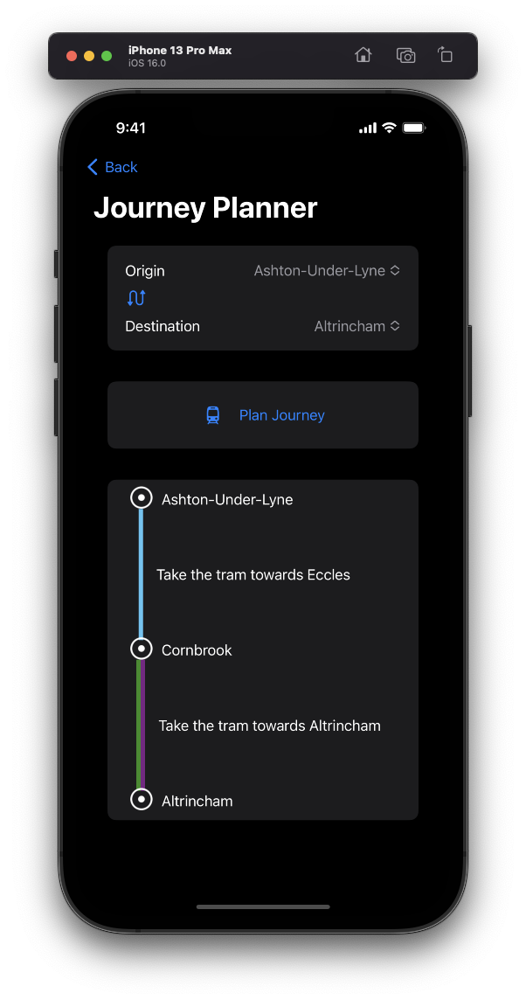
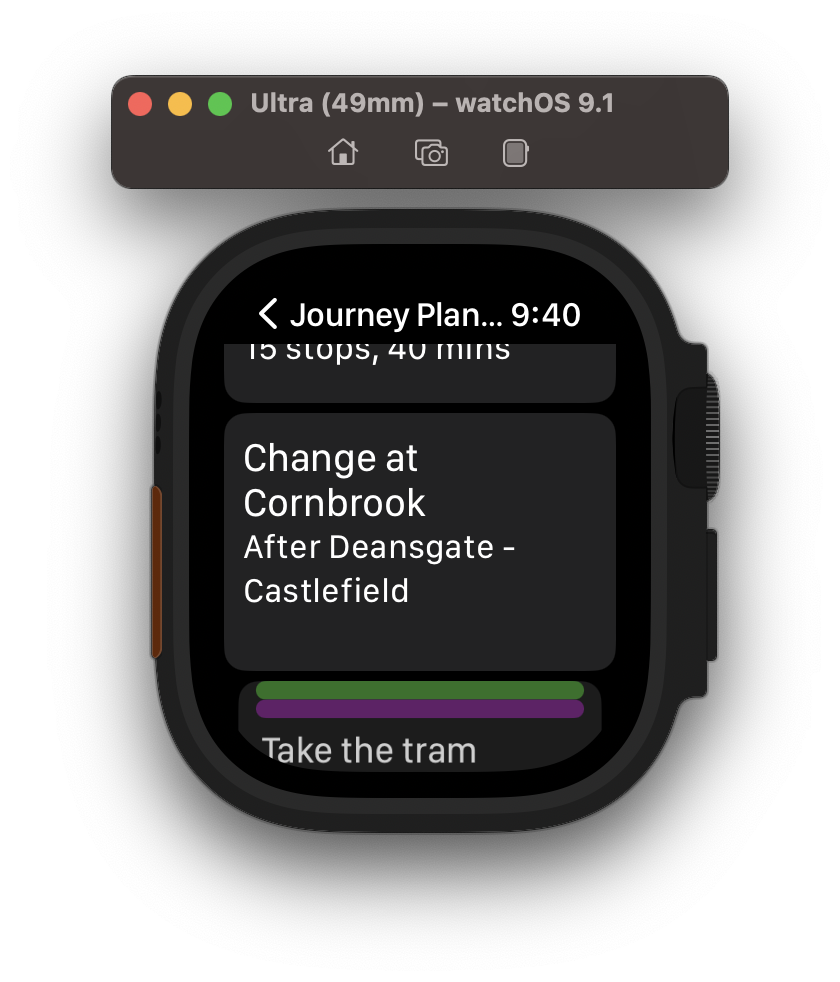
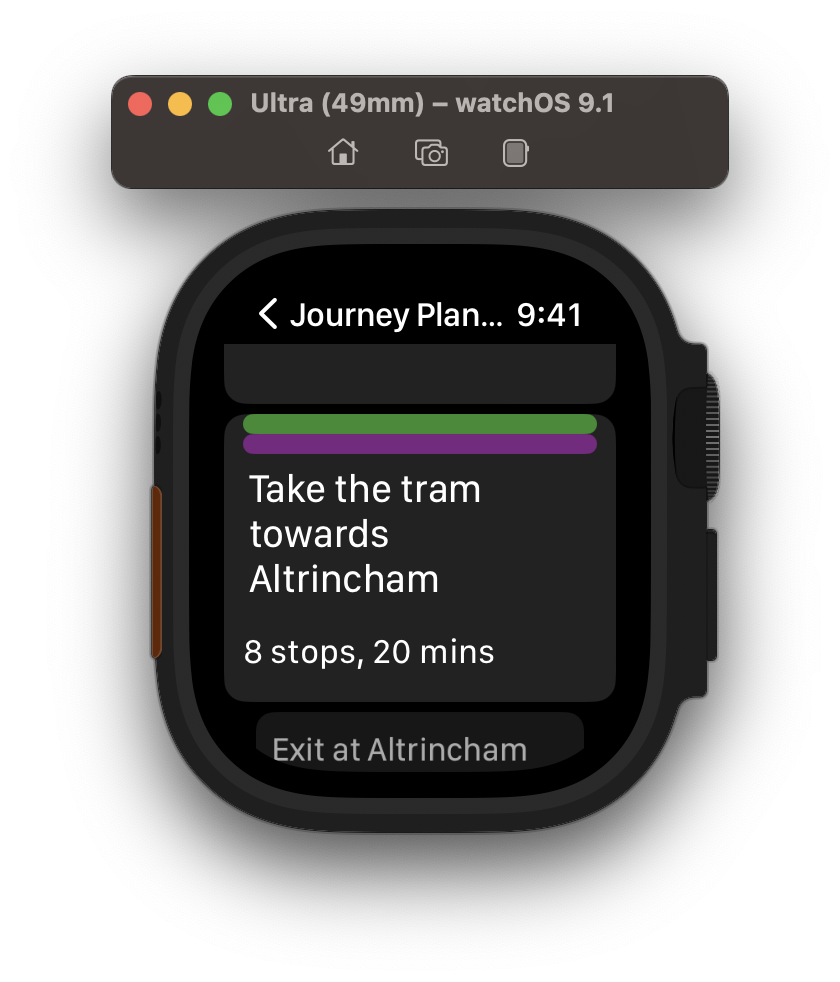
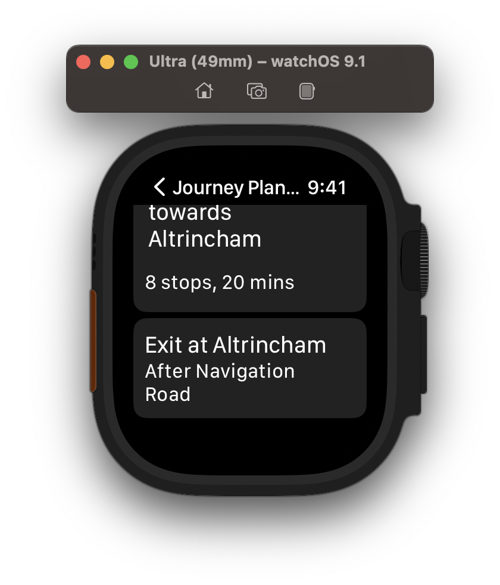
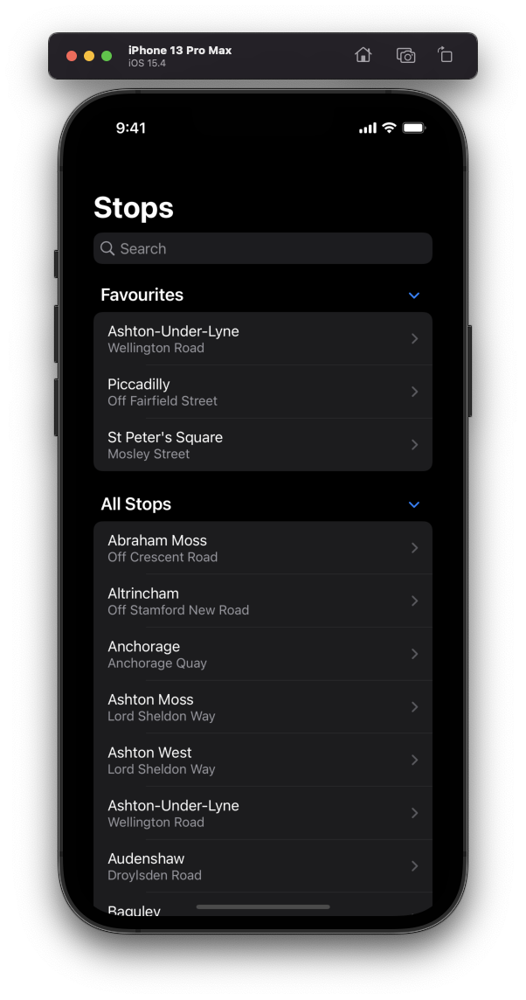
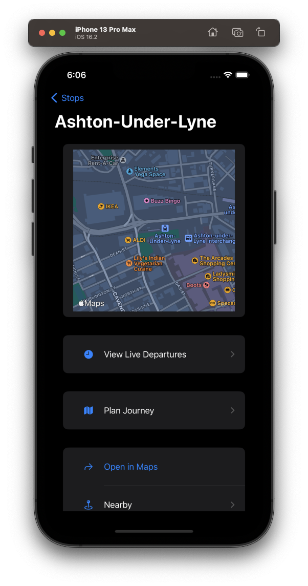
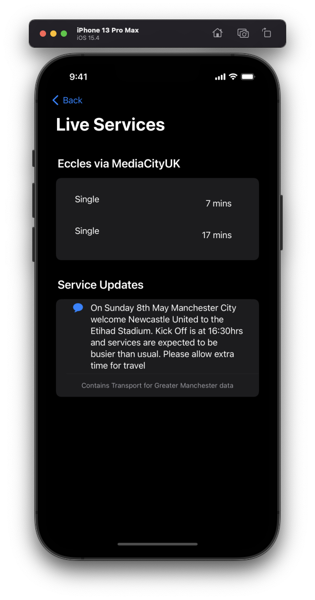
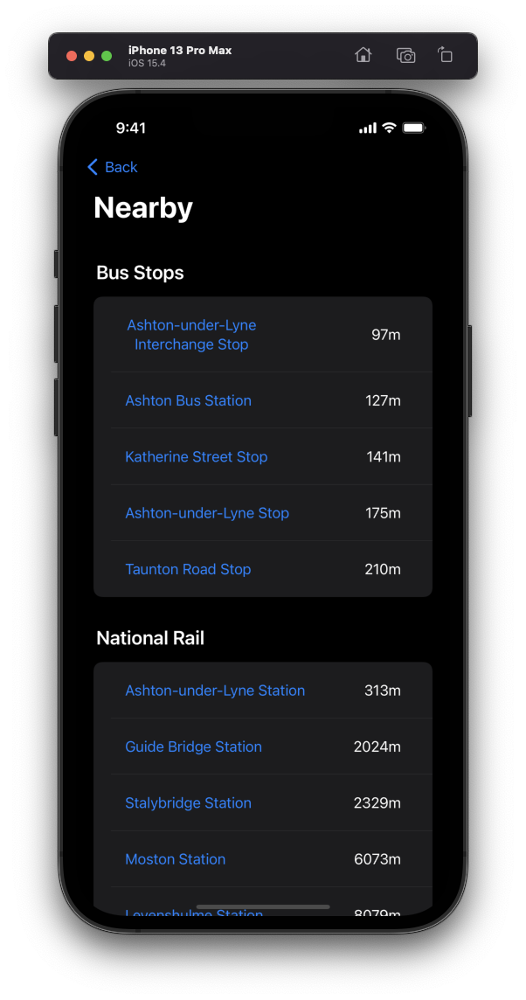

# LiveTramsMCR

## Contents
1. [Introduction](#introduction)
2. [Project Goals](#project-goals)
3. [Project Status](#project-status)
4. [Demo Screenshots](#demo-screenshots)
5. [Declaration](#declaration)

## Introduction
This is an iOS application built using SwiftUI that uses the [LiveTramsMCR-API Project](https://github.com/dave-t-c/LiveTramsMCR-API) to retreive and present data related to Manchester Metrolink Services / Stops

## Project Goals
- Create a mobile frontend for the LiveTramsMCR project- Experiment with SwiftUI
- Learn some Swift in the process
- Use some of Swifts features such as MapKit

Please note: This project was created for a bit of fun and to learn a bit more and use SwiftUI, so most likely doesn't follow best practices 😀

## Project Status
The project currently features:
- Displaying all stops and the road they are on in a searchable list
- Detailed stop view including a map of the area, it's stop zone and a link to open in Apple maps for directions
- View of live services split by destination, including relevant messages, e.g. for engineering work.
- View of nearby bus stops, national rail stations and cafes for each stop.
- Journey planning between any stop on the network.

## Demo Screenshots
## Journey Planner

 

### All Stops

### Detailed Stop View

### Live Services

### Nearby Locations

## Declaration
The App icon used for this program is from [Zondicons](https://github.com/dukestreetstudio/zondicons) which was 
created by [dukestreetstudio](https://github.com/dukestreetstudio). This is used under the [MIT License](https://github.com/dukestreetstudio/zondicons/blob/master/LICENSE).
A copy of this license has been included [here](./LiveTramsMCR/Shared/Assets.xcassets/AppIconLicense.md).

This program is in no way associated with TfGM.

The data in this application is used under the Open Government Licence v3.0

This program contains Transport for Greater Manchester data
